# Configuration Guide - Building a SOC Lab with Wazuh SIEM and Shuffle SOAR for Automated Threat Detection

This document is my full build log, written in the order I actually did things. I'm including the parts that broke, because that's most of what I actually learned from this project. If something below reads like I got it wrong the first time and fixed it the second time, that's exactly what happened — I didn't clean that part up.

---

## Chapter 1 - Introduction

### Why SIEM?

A SIEM exists because raw logs by themselves aren't usable at any real scale. A single Windows endpoint with Sysmon turned on generates thousands of events a day — process starts, network connections, registry writes. No analyst reads that one event at a time. A SIEM like Wazuh centralizes all of it, applies detection rules against it, and surfaces the small number of events that are actually worth looking at as alerts.

### Why SOAR?

A SIEM tells you something happened. It doesn't decide what to do next. In a real SOC, every alert needs someone (or something) to look at it, decide if it matters, and act on it — notify a team, check threat intel, sometimes isolate a host. Doing that by hand for every single alert doesn't scale past a handful of endpoints. A SOAR platform like Shuffle takes an alert and runs a workflow against it automatically the moment it arrives, without an analyst needing to be watching a dashboard at that exact moment.

### Objectives

- Deploy a working Wazuh SIEM stack monitoring a real Windows endpoint
- Generate genuine, attributable telemetry using Sysmon rather than relying on synthetic test data alone
- Deploy Shuffle SOAR alongside Wazuh on the same host without either one interfering with the other
- Build a real webhook integration connecting the two
- Automate an email notification the moment an alert is received
- Document the troubleshooting honestly, because that's most of what I actually learned

### Project Scope

Two virtual machines. One Docker host running both the SIEM stack and the SOAR stack side by side. One monitored Windows endpoint. Everything used here is open-source and self-hosted - no cloud infrastructure and no paid licenses.

---

## Chapter 2 - Lab Architecture

I began this project by reusing the virtual lab environment from my earlier SIEM build, created in VMware Workstation. The goal was the same as before - simulate a small enterprise network where security events on a Windows endpoint get picked up by Wazuh — but this time with a second layer added on top: Shuffle, sitting between the alert and the analyst's inbox.

- **Hypervisor:** VMware Workstation (VirtualBox also works fine for this — I used VirtualBox for the Kali VM specifically in this build)
- **VM 1 — Kali Linux:** 7 GB RAM, 5 vCPUs on an i5-1235U host, roughly 47 GB disk. Runs Docker and hosts both the Wazuh stack and the Shuffle stack.
- **VM 2 — Windows 10 Pro (build 10.0.17763):** the monitored endpoint. Runs Sysmon and the Wazuh Agent.
- **Networking:** both machines on the same internal network, statically reachable from each other.
- **IP Assignment:** Kali at `192.168.100.3`, Windows at `192.168.100.4`.

Before deciding on this layout, I checked whether the Kali VM could actually hold two Docker stacks running at once:

```bash
free -h
lscpu
df -h
docker --version
```

7 GB of RAM and 5 vCPUs turned out to be enough, but only just — I had to watch disk usage carefully later on, which is covered in Chapter 10.

I decided against a third VM for Shuffle. Running it as additional Docker containers on the same Kali host as Wazuh kept the lab simpler to manage, and the resource check above confirmed there was room for it.

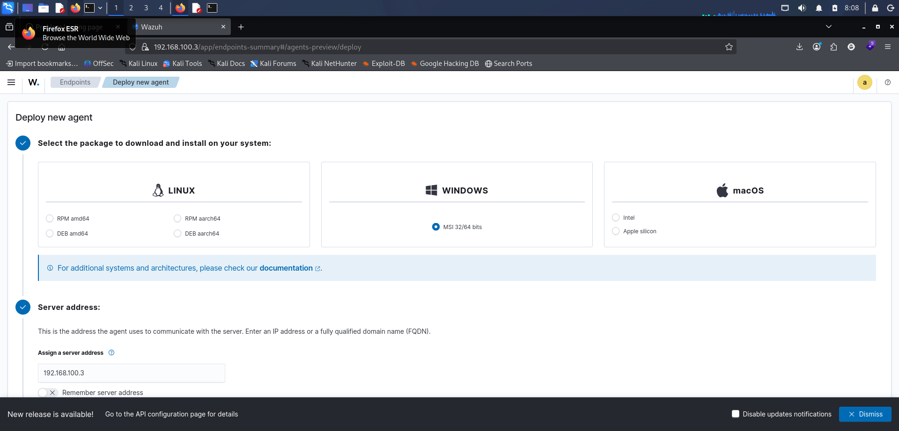
---

## Chapter 3 - Installing Docker

Docker was already present on this Kali VM from an earlier project, but for anyone rebuilding this lab from scratch, here's exactly what I ran and why.

```bash
sudo apt remove docker docker-engine docker.io containerd runc -y
sudo apt install docker.io git curl unzip wget -y
```

`docker.io` is Kali's packaged Docker Engine. `git` is needed to clone both the Wazuh and Shuffle repositories. `curl` and `wget` get used constantly later for testing the webhook and downloading the Wazuh agent installer.

```bash
sudo systemctl enable docker
sudo systemctl start docker
sudo usermod -aG docker $USER
sudo reboot
```

Adding my user to the `docker` group meant I didn't need `sudo` in front of every Docker command for the rest of the project — small thing, but it matters when you're running dozens of `docker` commands a day.

**Verification after reboot:**

```bash
docker --version
docker compose version
docker run hello-world
```

**Expected output:** `docker --version` returns something like `Docker version 28.5.2`. `docker run hello-world` pulls a tiny test image and prints a short confirmation message, which is the real proof that Docker's networking and image-pull pipeline both work — not just that the binary is installed.

One thing worth flagging: Kali doesn't always ship the standalone `docker-compose` binary in its default repos. Every command in this guide uses `docker compose` (with a space, no hyphen) — the Compose plugin that comes bundled with modern `docker.io`.

---

## Chapter 4 - Installing Wazuh

### Why the version matters

My first attempt cloned `wazuh-docker`'s `main` branch, the same way I had for my previous SIEM lab. This time it didn't contain the certificate-generation file (`generate-indexer-certs.yml`) the setup instructions expected — the `main` branch's directory layout had changed since I last used it. I fixed this by cloning a specific tagged release instead of `main`.

```bash
mkdir -p ~/Projects && cd ~/Projects
git clone -b v4.12.0 https://github.com/wazuh/wazuh-docker.git
cd wazuh-docker/single-node
```

### Manager, Indexer, Dashboard

**Generate the SSL certificates the Indexer needs:**

```bash
docker compose -f generate-indexer-certs.yml run --rm generator
ls config/wazuh_indexer_ssl_certs
```

**Expected output:** a folder full of `.pem` files — root CA, admin, and per-node certificates.

**Start the stack:**

```bash
docker compose up -d
docker ps
```

**Expected output:** three containers, all `Up` — `wazuh.manager`, `wazuh.indexer`, `wazuh.dashboard`. The manager listens on `1514/1515` (agent traffic) and `55000` (REST API). The indexer listens on `9200`. The dashboard is mapped to host port `443`.

### Agent

From the Dashboard (`https://192.168.100.3`), I went to **Agents → Deploy new agent → Windows**, entered the Kali IP as the server address, named the agent `windows10`, and copied the generated install command onto the Windows VM, run as Administrator:

```powershell
Invoke-WebRequest -Uri https://packages.wazuh.com/4.x/windows/wazuh-agent-4.12.0-1.msi -OutFile $env:TEMP\wazuh-agent.msi
msiexec.exe /i $env:TEMP\wazuh-agent.msi /q WAZUH_MANAGER="192.168.100.3" WAZUH_AGENT_NAME="windows10" /norestart
Start-Service WazuhSvc
```

### Verification

```bash
docker exec -it single-node-wazuh.manager-1 /var/ossec/bin/agent_control -lc
```

**Expected output:**
```
ID: 004, Name: windows10, IP: any, Active
```

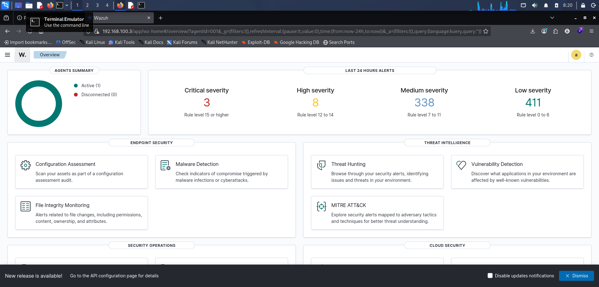
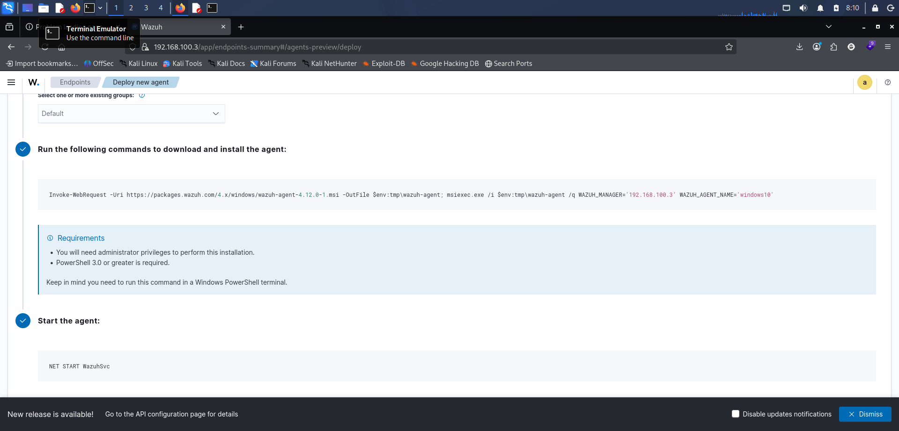
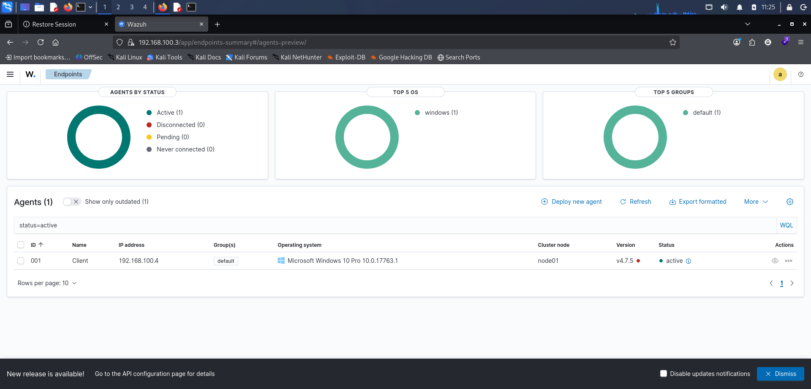
---

## Chapter 5 - Installing Sysmon

### Why Sysmon

Wazuh on its own only sees what the standard Windows Event Log already records, which isn't very detailed. Sysmon, from Microsoft's Sysinternals suite, logs far more useful information — full process command lines, network connections, file creation, registry changes, DNS queries. Without it, a Wazuh alert like "PowerShell ran" tells you almost nothing about what actually happened. With it, you get the exact command that was executed.

### Configuration

Sysmon was already installed with a working configuration from my previous lab. I confirmed it was still running before relying on it here:

```powershell
& "C:\Windows\Sysmon64.exe" -c
Get-Service Sysmon64
```

**Expected output:** service status `Running`, and the `-c` flag prints the currently loaded configuration rules.

The Wazuh Agent needs to be told to actually read the Sysmon channel. This goes into `C:\Program Files (x86)\ossec-agent\ossec.conf`:

```xml
<localfile>
  <location>Microsoft-Windows-Sysmon/Operational</location>
  <log_format>eventchannel</log_format>
</localfile>
```

After adding it, I restarted the agent service:

```powershell
Restart-Service WazuhSvc
```

### Verification

```powershell
Get-WinEvent -LogName "Microsoft-Windows-Sysmon/Operational" -MaxEvents 10
Get-WinEvent -FilterHashtable @{ LogName='Microsoft-Windows-Sysmon/Operational'; ID=1 } -MaxEvents 5
```

If these return recent events, Sysmon is generating telemetry. Confirming Wazuh was actually ingesting it meant checking the Threat Hunting view in the Dashboard, filtered on `rule.groups:sysmon`.

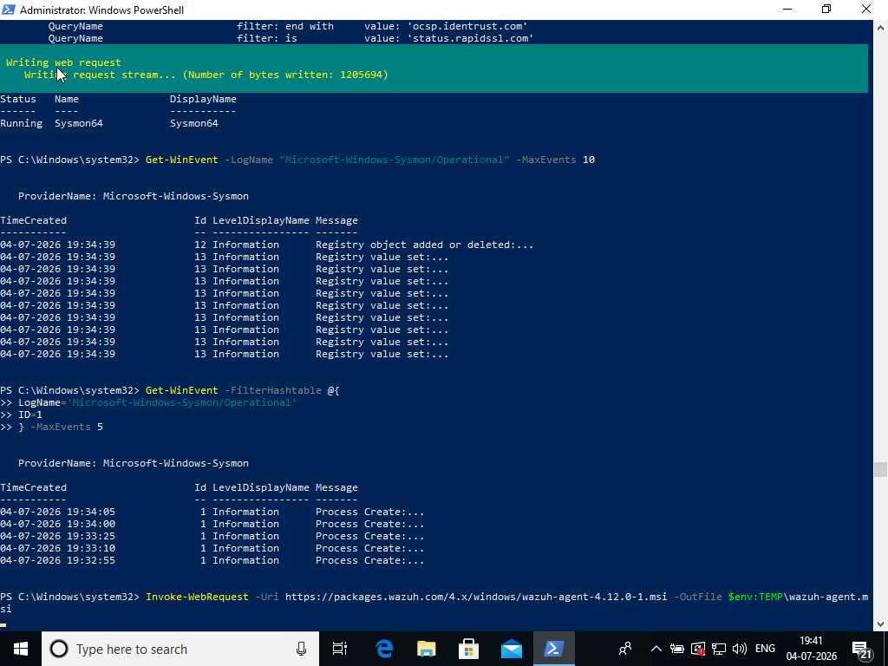
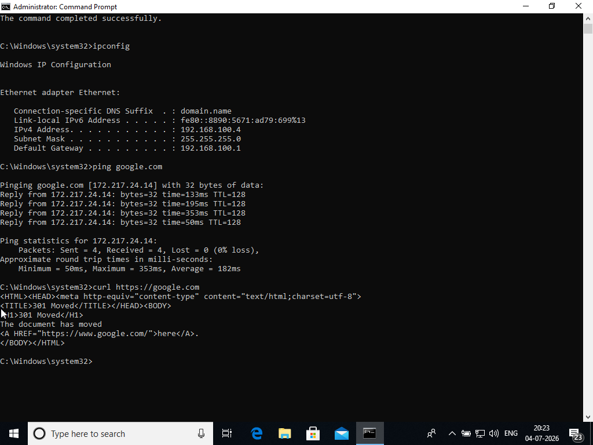
---

## Chapter 6 - Installing Shuffle SOAR

### Containers

I deliberately kept Shuffle as a completely separate Docker Compose project from Wazuh — a different folder, no shared Docker network. The reasoning was simple: if Shuffle breaks, I didn't want it to take Wazuh down with it.

```bash
mkdir -p ~/Projects/wazuh-soar/docker && cd ~/Projects/wazuh-soar/docker
git clone https://github.com/Shuffle/Shuffle.git
cd Shuffle
```

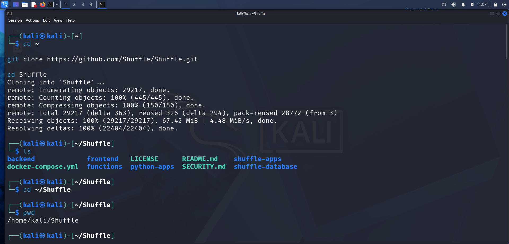
### Docker Compose

First attempt at bringing it up failed immediately:

```
Error response from daemon: driver failed programming external connectivity ...
Bind for 0.0.0.0:9200 failed: port is already allocated
```

Both Wazuh's Indexer and Shuffle's own bundled OpenSearch container default to host port `9200`. I found the line and remapped the host-facing side only:

```bash
grep -n "9200" docker-compose.yml
```

```yaml
ports:
  - 9201:9200   # was 9200:9200
```

The container's internal port stays `9200` — nothing inside Shuffle needed to change, since its backend talks to `shuffle-opensearch:9200` over its own internal Docker network regardless of what the host-side mapping is.

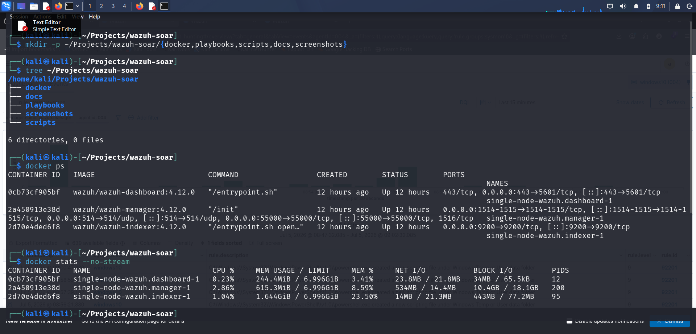
```bash
docker compose down
docker compose up -d
docker ps
```

**Expected output:** containers `shuffle-frontend`, `shuffle-backend`, `shuffle-opensearch`, `shuffle-orborus` (plus worker containers) all `Up`, alongside the three Wazuh containers from Chapter 4, untouched.

### Workflow creation

I opened `http://192.168.100.3:3001`, created the initial admin account on Shuffle's first-run screen, and created a new workflow named **Wazuh SOAR Demo**.

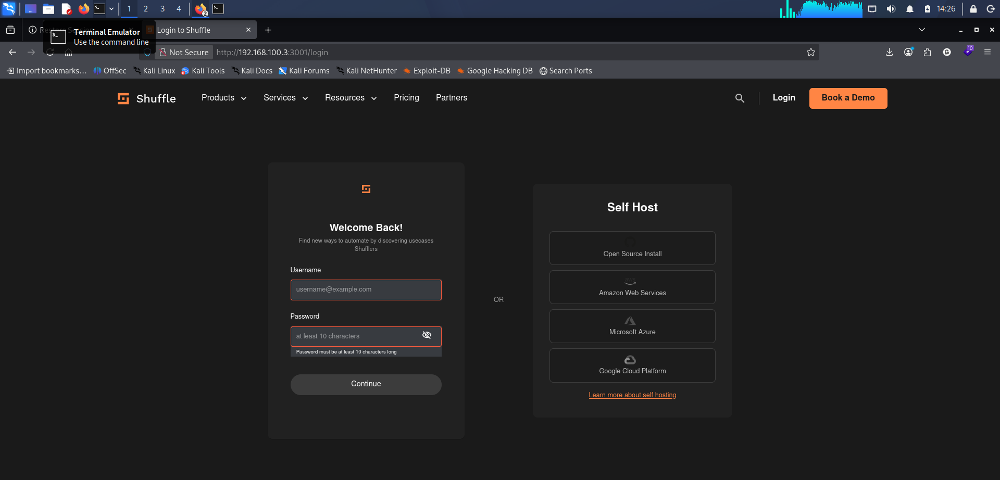
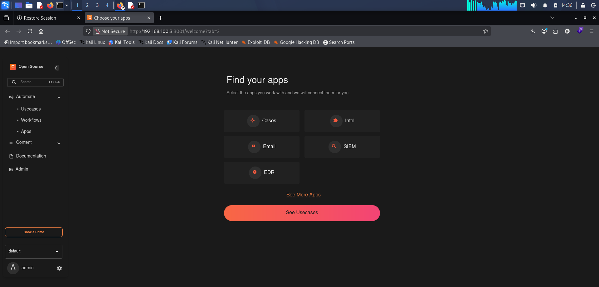
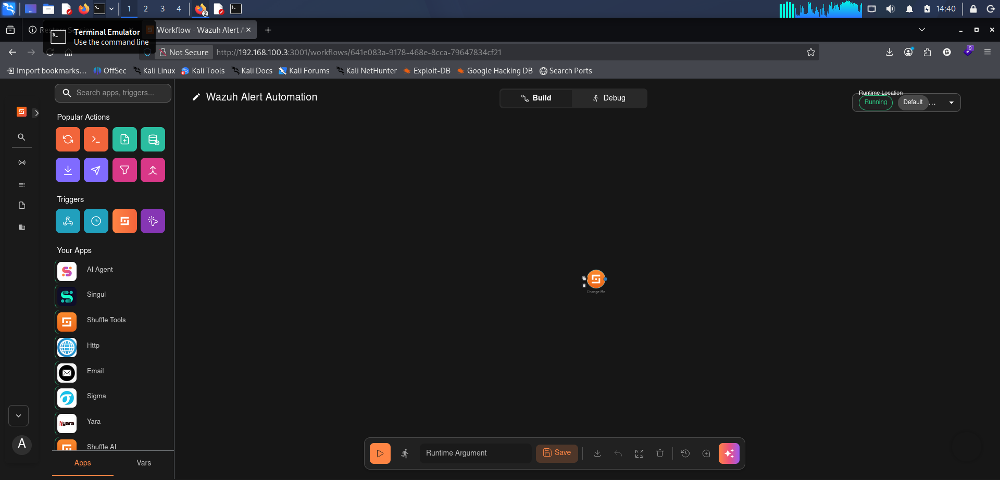
### Webhook creation

I dragged a **Webhook** trigger onto the canvas, saved the workflow, and clicked **Start** on the trigger to activate it. Only once it's actively running does the full webhook URL show up:

```
http://192.168.100.3:3001/api/v1/hooks/webhook_<unique-id>
```

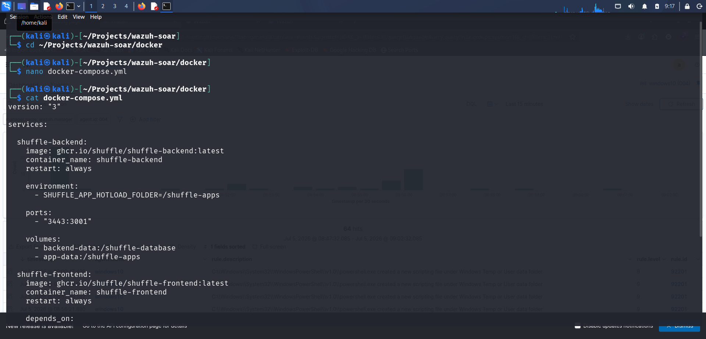
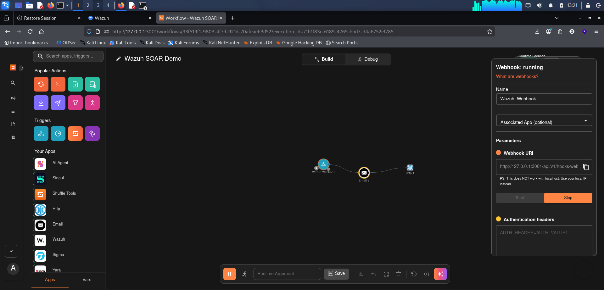
### Email configuration

I configured the **Send Email SMTP** action — not "Send Email Shuffle," which I initially confused it with (see Chapter 10) — using Gmail's SMTP relay and an app password rather than my normal account password:

```
SMTP host: smtp.gmail.com
SMTP port: 587
Username:  <gmail address>
Password:  <gmail app password>
Recipient: <destination address>
```

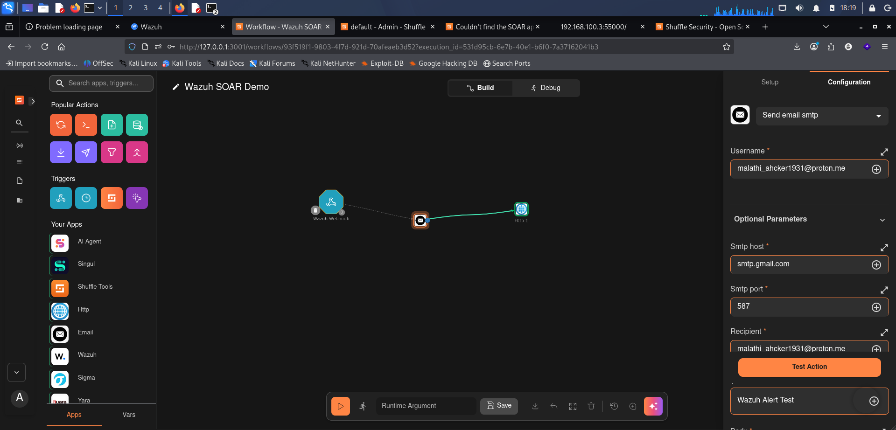
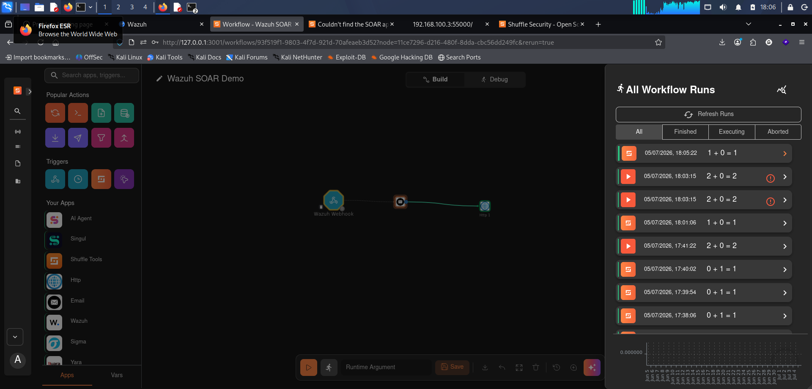
---

## Chapter 7 - Connecting Wazuh to Shuffle

### Webhook integration

Shuffle has an official "Wazuh" app in its app marketplace, and I tried that first before building anything manually. It failed outright with an error about a missing app reference — covered in detail in Chapter 10. Rather than keep fighting it, I built the same integration using a generic **HTTP node** authenticating directly against the Wazuh REST API.

**Step 1 - generate a JWT from Wazuh:**

```bash
curl -k -u wazuh-wui:'<api_password>' \
  "https://192.168.100.3:55000/security/user/authenticate?raw=true"
```

This returns a token starting `eyJ...`, valid for roughly 15 minutes.

**Step 2 - configure the HTTP node:**

```
Method:      GET
URL:         https://192.168.100.3:55000/
SSL Verify:  False
Headers:
  Authorization: Bearer <jwt_token>
  Content-Type: application/json
```

I left the username/password fields on the node blank — the Bearer token in the header is the actual authentication mechanism here, not Basic Auth.

### ossec.conf

To route alerts out of Wazuh toward the webhook, an `<integration>` block goes inside the manager's config:

```xml
<integration>
  <name>custom-shuffle</name>
  <hook_url>http://192.168.100.3:3001/api/v1/hooks/webhook_<unique-id></hook_url>
  <level>7</level>
  <alert_format>json</alert_format>
</integration>
```

This has to sit inside the existing `<ossec_config>` block, just before the closing `</ossec_config>` tag — not as a second, separate block (see Chapter 10 for what happens if you get this wrong).

### Restart services

```bash
docker compose restart wazuh.manager
docker exec -it single-node-wazuh.manager-1 tail -30 /var/ossec/logs/ossec.log
```

### Testing

```bash
curl -X POST "http://192.168.100.3:3001/api/v1/hooks/webhook_<id>" \
  -H "Content-Type: application/json" \
  -d '{"test":"hello"}'
```

**Expected output:** `{"success": true, "execution_id": "..."}` — confirmation the webhook received the call and kicked off the workflow.


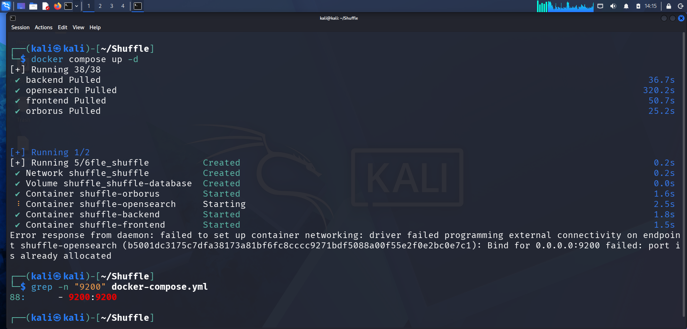

---

## Chapter 8 - Generating Alerts

I generated real telemetry on the Windows endpoint using a mix of PowerShell activity, file operations, and a network scan — kept non-destructive but realistic enough to actually trigger Wazuh's built-in detection rules.

```powershell
# Discovery / recon commands
whoami /priv
ipconfig
net user testuser Passw0rd123 /add
ping 8.8.8.8

# Suspicious file drop into a folder Wazuh watches for this
echo malware3 > C:\Users\Public\TestSOAR\evil4.txt

# Base64-encoded PowerShell - a common detection trigger
powershell -enc SQBFAHgAKABOAGUAdwAtAE8AYgBqAGUAYwB0ACAATgBlAHQALgBXAGUAYgBDAGwAaQBlAG4AdAApAC4ARABvAHcAbgBsAG8AYQBkAFMAdAByAGkAbgBnACgAJwBoAHQAdABwADoALwAvAGUAeABhAG0AcABsAGUALgBjAG8AbQAvAGEALgBwAHMAMQAnACkA
```

I also dropped a plain **EICAR test file** on the Windows box (the standard, harmless string every antivirus vendor recognizes as a test signature) to confirm Wazuh's file-monitoring rules would flag a "malicious-looking" file drop without needing an actual malicious binary:

```powershell
'X5O!P%@AP[4\PZX54(P^)7CC)7}$EICAR-STANDARD-ANTIVIRUS-TEST-FILE!$H+H*' | Out-File C:\Users\Public\TestSOAR\eicar.com
```

From Kali, I scanned the Windows box to generate network-facing telemetry as well:

```bash
nmap -A 192.168.100.4
```

These actions generated Sysmon Event ID 1 (process creation) and Event ID 11 (file creation), which Wazuh matched against rules including `92201` (PowerShell writing a scripting file to a Temp/User data folder) and `92213` (executable dropped in a folder commonly used by malware, severity 15). I confirmed all of this in the Dashboard's Threat Hunting view, cross-checking timestamps against the Windows event logs directly on the endpoint to make sure what Wazuh reported actually matched what happened.

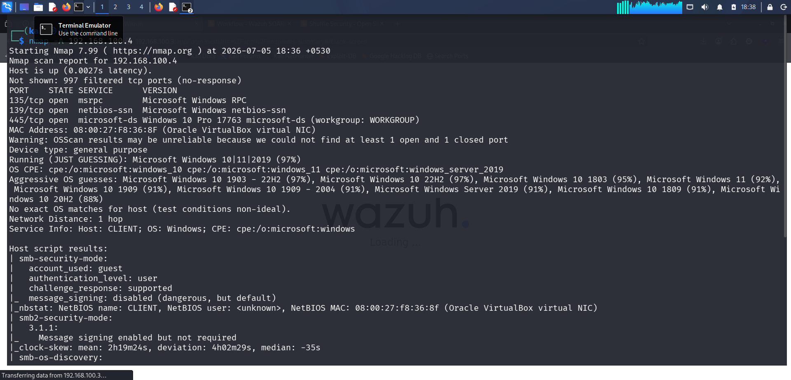
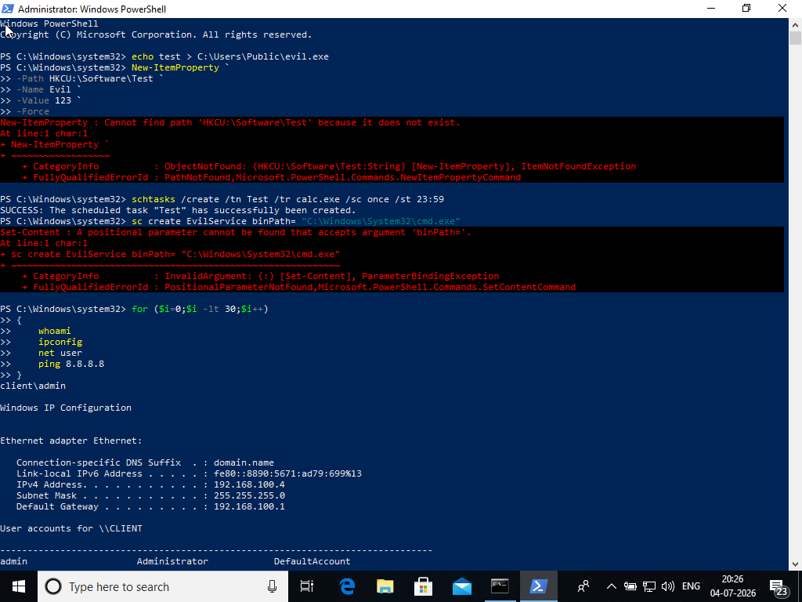
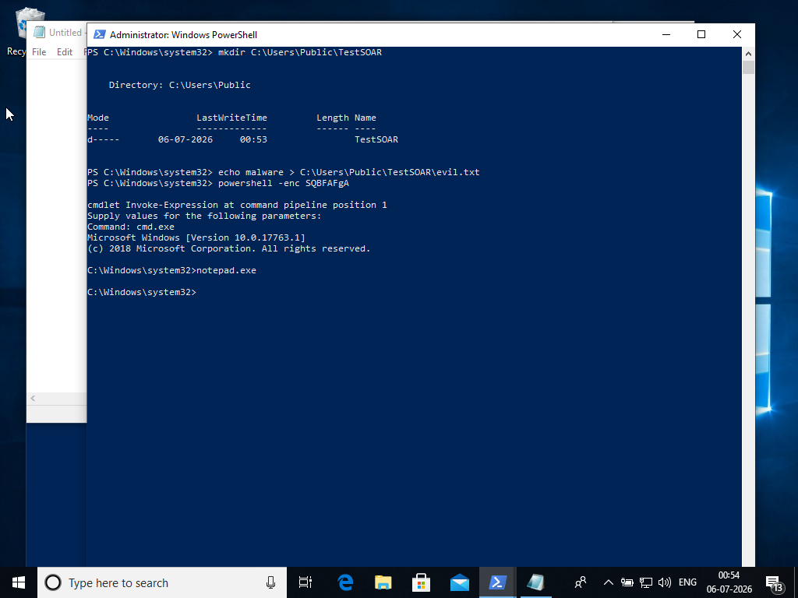
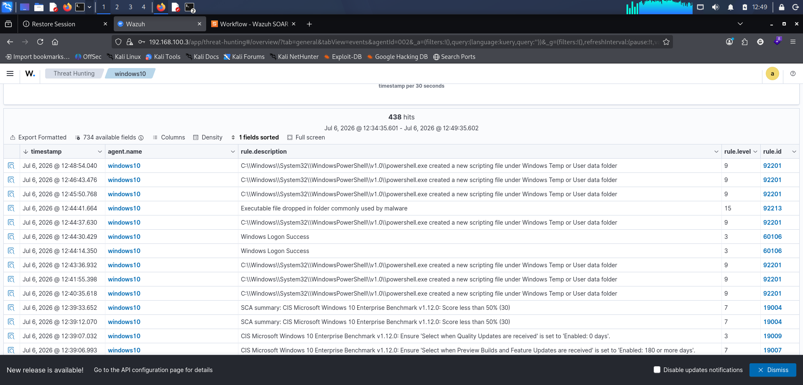
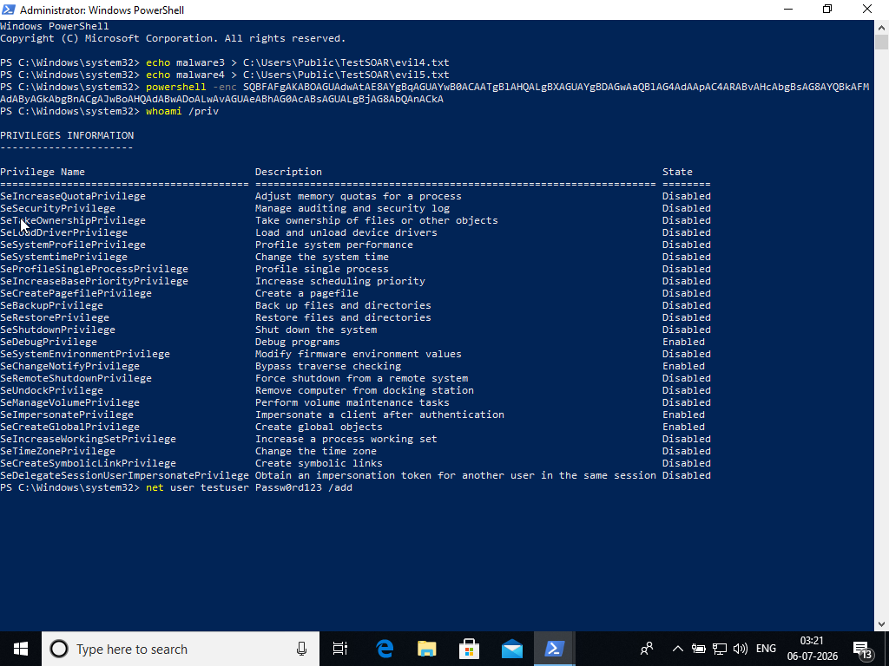
### MITRE ATT&CK mapping

Looking back at the activity I generated, most of it lines up with named ATT&CK techniques, which I hadn't actually labeled at the time I ran them. Mapping them after the fact:

| Activity performed | Wazuh rule | ATT&CK Technique |
|---|---|---|
| `whoami /priv`, `net user testuser Passw0rd123 /add` | 92031 / 92033 (Discovery activity) | T1087 — Account Discovery |
| `ipconfig`, `ping 8.8.8.8` | 92033 (Discovery activity spawned via PowerShell) | T1016 — System Network Configuration Discovery |
| Base64-encoded PowerShell command | 92201 (PowerShell scripting file under Temp/User data) | T1027 — Obfuscated Files or Information, T1059.001 — PowerShell |
| EICAR file drop | 92213 (Executable dropped in a folder commonly used by malware) | T1204 — User Execution |
| `nmap -A 192.168.100.4` (external scan, no agent telemetry — logged from the Kali side, not detected by Wazuh) | n/a | T1046 — Network Service Discovery |

Worth being honest about the last row: the Nmap scan didn't generate a Wazuh alert on its own — Wazuh was watching the Windows endpoint, not network traffic, so an external port scan against it isn't something the agent would see unless something like a host-based firewall log was also being monitored. I'm noting that here rather than implying it triggered a detection it didn't.

---

## Chapter 9 - SOAR Automation

To prove the pipeline wasn't a one-time lucky run, I fired ten synthetic Wazuh-shaped alerts directly at the webhook in a loop:

```bash
for i in {1..10}; do
  curl -s -X POST http://192.168.100.3:3001/api/v1/hooks/webhook_2ce87e52-0beb-4243-87b2-de4c15315462 \
    -H "Content-Type: application/json" \
    -d "{\"rule\":{\"level\":15,\"id\":\"92213\",\"description\":\"Executable file dropped in folder commonly used by malware - test $i\"},\"agent\":{\"name\":\"windows10\",\"ip\":\"192.168.100.4\"},\"timestamp\":\"2026-07-06T15:$((30+i)):00Z\"}"
  echo " → sent alert $i"
  sleep 2
done
```

**Expected/actual output:**
```
{"success": true, "execution_id": "b2e3b273-..."} → sent alert 1
{"success": true, "execution_id": "892f2322-..."} → sent alert 2
...
```

Each call ran the full chain in order:

1. **Webhook triggered** — Shuffle received the POST and kicked off the workflow instance
2. **Workflow executed** — the HTTP node ran next in the chain
3. **API request** — the HTTP node authenticated against the Wazuh REST API with the Bearer JWT and got back a `200` response
4. **Email sent** — the SMTP node fired, and a notification landed in the destination inbox within seconds

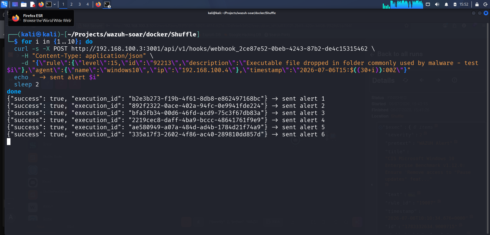

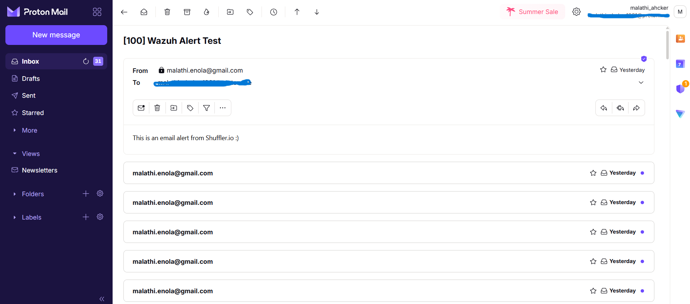
**Final success confirmed:**
- Webhook triggered on every call, no drops
- Workflow executed without manual intervention
- Wazuh API authentication succeeded consistently (HTTP 200, valid JWT)
- Email delivered every single time

---

## Chapter 10 - Challenges

None of the above worked on the first attempt. This is every real issue I hit, in the order I hit it, using the structure: Problem, Symptoms, Root Cause, Commands Used, Solution, What I Learned.

### 1. Docker installation issues

- **Problem:** Compose commands failed with "command not found" right after installing Docker.
- **Symptoms:** `docker-compose --version` returned nothing; the standalone binary Kali's tutorials usually reference wasn't present.
- **Root Cause:** Kali's default repositories package Docker with the Compose plugin bundled in, not the old standalone `docker-compose` binary most tutorials assume.
- **Commands used:** `docker compose version` (space, not hyphen).
- **Solution:** Used `docker compose` throughout instead of `docker-compose`.
- **What I learned:** Always check which Compose variant is actually installed before copying commands from a generic tutorial.

### 2. Container restart failures

- **Problem:** Restarting the Wazuh Manager after a config change failed.
- **Symptoms:** `Bind for 0.0.0.0:1514 failed: port is already allocated`.
- **Root Cause:** An unrelated container from an earlier project was still bound to port `1514`, which Wazuh's Manager also needs.
- **Commands used:** `docker ps`, `docker stop <container>`, `docker rm <container>`, `docker compose up -d`.
- **Solution:** Stopped and removed the conflicting container before restarting Wazuh.
- **What I learned:** Check every running container on the host, not just the ones from the project I was currently focused on.

### 3. Windows agent disconnecting

- **Problem:** The agent showed as disconnected after being re-added following the Docker rebuild in Chapter 4.
- **Symptoms:** `Invalid ID 001 for the source ip`, later `Duplicate agent name: windows10 (from manager)`.
- **Root Cause:** Stale keys in the Windows-side `client.keys` file no longer matched the manager's records after the agent was removed and re-registered.
- **Commands used:**
  ```bash
  docker exec -it single-node-wazuh.manager-1 /var/ossec/bin/manage_agents
  ```
  ```powershell
  Stop-Service WazuhSvc
  Remove-Item "C:\Program Files (x86)\ossec-agent\client.keys" -Force
  & "C:\Program Files (x86)\ossec-agent\agent-auth.exe" -m 192.168.100.3 -A windows10
  Start-Service WazuhSvc
  ```
- **Solution:** Deregistered the agent on both the manager and the Windows side before re-enrolling.
- **What I learned:** Agent identity in Wazuh depends on both a manager-side record and a local key file - resetting only one side isn't enough.

### 4. Sysmon configuration problems

- **Problem:** The agent showed Active, but no Sysmon events appeared in the Dashboard.
- **Symptoms:** Threat Hunting view returned zero results for `rule.groups:sysmon`.
- **Root Cause:** The `<localfile>` block for the Sysmon channel hadn't been added to the agent's `ossec.conf` yet.
- **Solution:** Added the `eventchannel`-formatted `<localfile>` block pointed at `Microsoft-Windows-Sysmon/Operational` and restarted the agent service.
- **What I learned:** An "Active" agent status only confirms connectivity to the manager - it says nothing about which log sources are actually being collected.

### 5. Wazuh integration script errors

- **Problem:** After manually editing the manager's config to add the Shuffle integration, the manager failed to start.
- **Symptoms:** No clear error in the dashboard, but `docker ps` showed the manager container repeatedly restarting.
- **Root Cause:** My edit had accidentally created two separate `<ossec_config>` blocks instead of adding the `<integration>` tag inside the existing one — invalid XML from Wazuh's point of view.
- **Commands used:** `docker exec -it single-node-wazuh.manager-1 tail -50 /var/ossec/logs/ossec.log`.
- **Solution:** Removed the duplicate wrapper and kept a single `<ossec_config>` block with `<integration>` placed just before the closing tag.
- **What I learned:** Always check the config file both before and after an edit - a malformed config often fails silently until the next restart.

### 6. Using `YOUR_HOOK_ID`

- **Problem:** Copy-pasted a webhook URL that still had a placeholder in it.
- **Symptoms:** Requests to the webhook returned a 404 with no useful message.
- **Root Cause:** I'd copied an example URL from documentation instead of the actual generated one from my running workflow.
- **Solution:** Went back into Shuffle, opened the actual Webhook node, and copied the real generated ID.
- **What I learned:** Never trust a URL that still contains an obvious placeholder string - always copy directly from the live node, not from memory or an example.

### 7. Invalid webhook

- **Problem:** Webhook URL looked correct but requests still failed.
- **Symptoms:** The copied URL ended at `/hooks` with no trailing ID at all.
- **Root Cause:** The workflow hadn't actually been started — Shuffle only generates the full, usable webhook path once the trigger is explicitly activated.
- **Solution:** Saved the workflow, clicked **Start** on the Webhook trigger, then copied the complete URL including the `webhook_<uuid>` suffix.
- **What I learned:** A webhook URL in Shuffle isn't "live" just because a workflow exists - the trigger has to be running.

### 8. HTTP vs HTTPS issues

- **Problem:** A request to the Wazuh API over plain HTTP failed.
- **Symptoms:** Connection reset, no response body.
- **Root Cause:** The Wazuh REST API only serves over HTTPS on port 55000, with a self-signed certificate by default.
- **Solution:** Used `https://` in the URL and set SSL Verify to `False` on the HTTP node (self-signed cert, lab environment).
- **What I learned:** Don't assume an internal API defaults to plain HTTP just because it's on a private network.

### 9. 401 Unauthorized

- **Problem:** The HTTP node kept getting rejected even with a token attached.
- **Symptoms:** `{"title": "Unauthorized", "detail": "Invalid token"}`.
- **Root Cause:** Two things stacked here — first, I'd configured Basic Auth (username/password fields) instead of a Bearer token header; second, the JWT itself had expired, since it's only valid for about 15 minutes.
- **Solution:** Cleared the username/password fields, added `Authorization: Bearer <token>` as a header, and generated a fresh token immediately before each test.
- **What I learned:** For any short-lived-token API, plan on regenerating the token constantly during manual testing, or better, automate the refresh as its own workflow step.
- 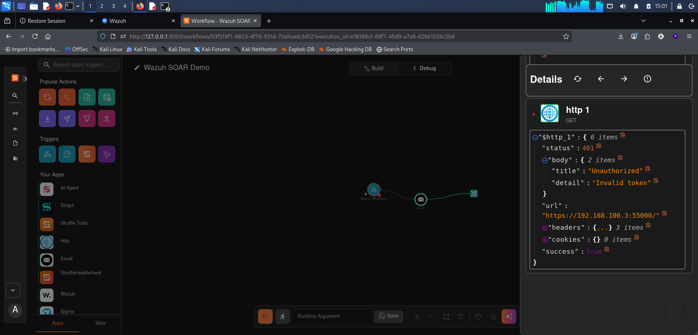
### 10. 502 Bad Gateway

- **Problem:** The Shuffle frontend returned an error page on load.
- **Symptoms:** `502 Bad Gateway` in the browser.
- **Root Cause:** An earlier, incomplete Compose file I'd hand-written was missing the OpenSearch service entirely, so the backend had nothing to connect to.
- **Commands used:** `docker logs shuffle-backend --tail 50`.
- **Solution:** Discarded my incomplete file and used the official Shuffle repository's full `docker-compose.yml`, patching only the port line that needed changing.
- **What I learned:** Don't hand-assemble a subset of a multi-service stack from memory - use the vendor's official file.

### 11. OpenSearch failures

- **Problem:** Shuffle's OpenSearch container kept exiting shortly after starting.
- **Symptoms:** `docker ps` showed it repeatedly restarting; logs showed memory-related errors.
- **Root Cause:** Default JVM heap settings for OpenSearch (3GB) were tuned for a dedicated server, not a 7GB VM already running Wazuh's own Indexer at the same time.
- **Solution:** Reduced `OPENSEARCH_JAVA_OPTS` to `-Xms1024m -Xmx1024m` in the Compose file.
- **What I learned:** Two OpenSearch-based stacks on the same host will both reach for defaults sized for dedicated hardware - right-size the heap to what the host can actually spare.

### 12. Backend unable to connect

- **Problem:** Shuffle's backend logs repeated connection failures against its own database dependency.
- **Symptoms:** `connect: connection refused` targeting `shuffle-opensearch:9200`.
- **Root Cause:** OpenSearch was either still initializing or had crashed from the memory issue above.
- **Solution:** Fixed the memory settings first (issue #11), then waited for OpenSearch to fully initialize before expecting the backend to connect.
- **What I learned:** Multi-container stacks have startup order dependencies that aren't always obvious - a "connection refused" error from one container often means a different container hasn't finished starting yet.

### 13. Workflow not triggering

- **Problem:** Clicking the manual Run button in Shuffle's UI did nothing.
- **Symptoms:** No execution appeared in the workflow history.
- **Root Cause:** A Webhook-triggered workflow only runs on an actual incoming HTTP request - it isn't something the in-UI Run button can trigger manually.
- **Solution:** Triggered it properly using `curl -X POST <webhook_url>` instead.
- **What I learned:** Different trigger types behave completely differently when testing - know which kind you're using before assuming a manual Run button applies.

### 14. Trigger not started

- **Problem:** A saved workflow returned an error when I tried to test the webhook.
- **Symptoms:** "1 Workflow Issue - Trigger Webhook needs to be started" banner in the UI.
- **Root Cause:** Saving a workflow doesn't automatically activate its triggers - the Webhook node needs to be explicitly started separately.
- **Solution:** Clicked **Start** on the Webhook node itself before testing.
- **What I learned:** Save and Start are two different actions in Shuffle, and only one of them makes a trigger actually live.

### 15. Disk usage reaching 100%

- **Problem:** Docker builds and container starts began failing partway through the project.
- **Symptoms:** `df -h` showed the root partition nearly full.
- **Root Cause:** Dozens of exited Shuffle containers (Docker kept recreating worker containers on restart attempts) plus leftover images from an earlier project had consumed most of the 47GB disk.
- **Commands used:**
  ```bash
  docker container prune -f
  docker image prune -a -f
  docker system df
  sudo du -h --max-depth=1 /var/lib/docker | sort -hr
  ```
- **Solution:** Removed exited containers and unused images first, then identified `/var/lib/docker/overlay2` as the largest remaining consumer.
- **What I learned:** Docker will actively recreate certain stopped containers to maintain replica counts - a plain `docker stop` isn't always enough to keep them gone.

### 16. `No space left on device`

- **Problem:** Even after pruning containers and images, disk space ran out entirely mid-cleanup.
- **Symptoms:** Every Docker command started failing with `no space left on device`.
- **Root Cause:** While trying to manually reclaim space, I ran a direct `rm -rf` against part of `/var/lib/docker/overlay2` instead of using Docker's own prune commands, which left Docker's internal storage in a broken, inconsistent state.
- **Solution:** No partial fix worked reliably. I fully stopped Docker, wiped `/var/lib/docker` and `/var/lib/containerd` completely, and restarted the daemon.
  ```bash
  sudo systemctl stop docker containerd
  sudo rm -rf /var/lib/docker /var/lib/containerd
  sudo systemctl start containerd docker
  docker run hello-world
  ```
- **What I learned:** Never manually delete inside Docker's internal storage directories. `docker system prune -a --volumes -f` is the correct way to reclaim space - a manual `rm -rf` against `overlay2` isn't a cleanup command, it's a corruption command.

### 17. OpenSearch recovery

- **Problem:** After the full Docker wipe above, both Wazuh and Shuffle needed to be rebuilt from nothing.
- **Symptoms:** No containers, no images, no volumes remained.
- **Root Cause:** Direct consequence of issue #16.
- **Solution:** Rebuilt Wazuh from the same pinned `v4.12.0` tag as Chapter 4, and rebuilt Shuffle with the port fix from Chapter 6 already applied. Re-enrolled the Windows agent following the same process as issue #3.
- **What I learned:** Keeping notes on exact commands and version tags as I went meant the rebuild, while frustrating, only took a fraction of the time the original setup did.

### 18. Email automation testing

- **Problem:** The very first Email node test failed.
- **Symptoms:** `$node, $node are not accessible in this action`, and after fixing that, a separate `404 page not found`.
- **Root Cause:** The variable error came from using a template syntax Shuffle didn't resolve correctly between those specific nodes. The 404 came from selecting **Send Email Shuffle** - which routes through Shuffle's own cloud-hosted `shuffler.io` service and needs an API key from that platform - instead of **Send Email SMTP**, which talks to a real mail relay directly.
- **Solution:** Fixed the variable reference syntax to match what the node actually exposed, then switched the action to **Send Email SMTP** configured against Gmail's relay.
- **What I learned:** Shuffle has multiple actions with almost identical names that behave completely differently — read the exact action name before assuming it matches what worked previously.
- 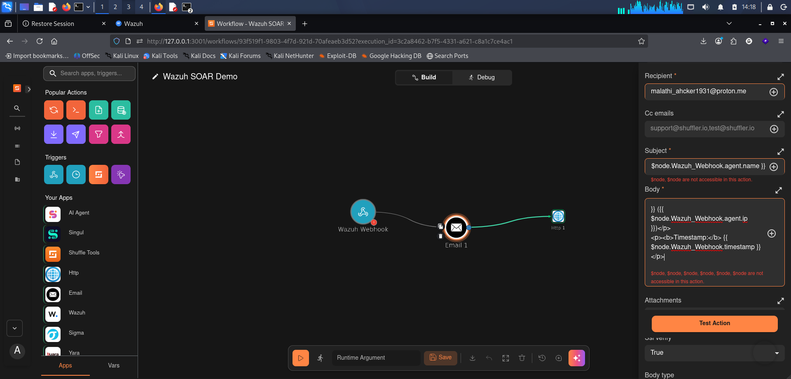
- 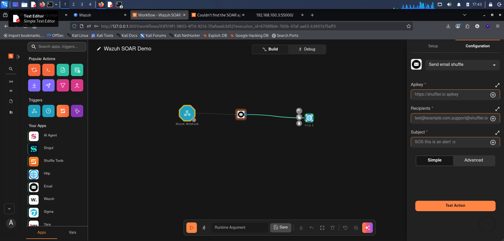
- 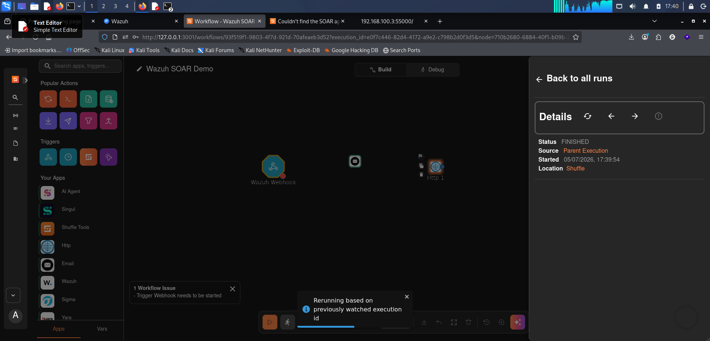
### 19. Final successful workflow execution

- **Problem:** None - this is the payoff after fixing all eighteen issues above.
- **Symptoms:** The full chain - webhook received, HTTP node authenticated against the Wazuh API, SMTP node sent the email - ran correctly and repeatably.
- **Solution:** Verified with both the scripted loop of synthetic alerts (Chapter 9) and real endpoint attack telemetry (Chapter 8).
- **What I learned:** Every one of the eighteen issues above touched a different layer of the stack — packaging, networking, authentication, resource limits, Docker internals, application-level configuration. Getting a SIEM+SOAR pipeline working end-to-end meant being comfortable debugging at all of those layers, not just clicking through a UI until something happened to work.

---

## Chapter 11 - What I'm Adding Next (Not Yet Implemented)

Everything above this point is what I actually built and tested. This section is different — it's work I've scoped out but haven't run yet, and I'm labeling it that way on purpose instead of blurring the line.

### Planned: a custom Wazuh detection rule

Right now, every alert in this lab comes from Wazuh's built-in ruleset. The next thing I want to add is a rule I've actually written myself, not just triggered. Here's the one I'm planning to test first — it tightens up detection of the encoded PowerShell pattern from Chapter 8, which the default `92201` rule catches generically but doesn't flag with any extra weight for the base64-encoding specifically:

```xml
<group name="custom,powershell,">
  <rule id="100210" level="12">
    <if_sid>92201</if_sid>
    <field name="win.eventdata.commandLine" type="pcre2">(?i)-enc(odedcommand)?\s+[A-Za-z0-9+/=]{40,}</field>
    <description>Encoded PowerShell command executed - possible obfuscation attempt</description>
    <mitre>
      <id>T1027</id>
      <id>T1059.001</id>
    </mitre>
  </rule>
</group>
```

This would go into `/var/ossec/etc/rules/local_rules.xml` on the manager, followed by:

```bash
docker exec -it single-node-wazuh.manager-1 /var/ossec/bin/wazuh-control restart
```

I haven't run this yet. Once I do, the plan is to re-run the exact same encoded-PowerShell command from Chapter 8 and confirm the new rule (`100210`) fires at a higher severity than the generic `92201` alert it currently produces, then add the real screenshot here.

### Planned: threat intel enrichment before the email fires

The current workflow is Webhook → HTTP (Wazuh auth) → Email. The next version I want to build adds one more node between the HTTP call and the email: a lookup against VirusTotal's free-tier API for any file hash or IP present in the alert, so the email that lands in the inbox already says whether the indicator is known-bad instead of the analyst having to check that separately.

Rough shape of the addition:

```
Webhook → HTTP (Wazuh auth) → HTTP (VirusTotal lookup) → Email (now includes VT verdict)
```

```bash
curl -s --request GET \
  --url "https://www.virustotal.com/api/v3/ip_addresses/<ip>" \
  --header "x-apikey: <vt_api_key>"
```

Also not implemented yet. When it is, I'll update this section with the real config and a screenshot of an email that actually includes a VirusTotal verdict.

### Planned: a short demo recording

A 2-minute screen recording showing an alert fire end-to-end — attack command run on Windows, alert appear in Wazuh, workflow execute in Shuffle, email land in the inbox - all in one continuous take. Screenshots prove each step happened; a video proves they happened *in sequence*, which is a different (and stronger) kind of proof.

---

## Final Results

*(Full screenshot set - 33 images total - also browsable directly in [`/screenshots`](./screenshots))*


*Figure 1: Shuffle's login screen after first deployment.*

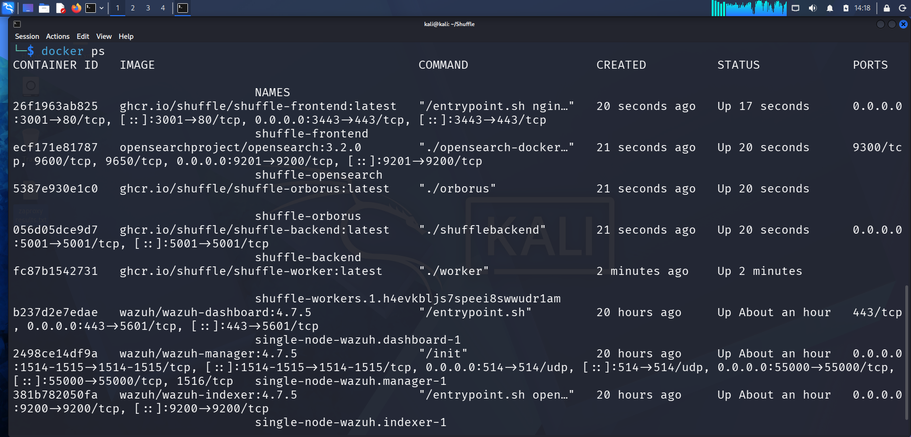
*Figure 2: Wazuh and Shuffle containers running together on the same host without conflict.*


*Figure 3: Wazuh alert dashboard showing live Sysmon detections for the monitored endpoint.*


*Figure 4: Successful execution of the Shuffle workflow after receiving a Wazuh alert.*


*Figure 5: The 401/Invalid token error encountered mid-integration (Challenge #9).*


*Figure 6: Working SMTP configuration after correcting the email node mix-up.*


*Figure 7: The scripted loop firing ten synthetic alerts through the webhook.*


*Figure 8: 213 hits recorded in Wazuh Threat Hunting for the endpoint over the session.*

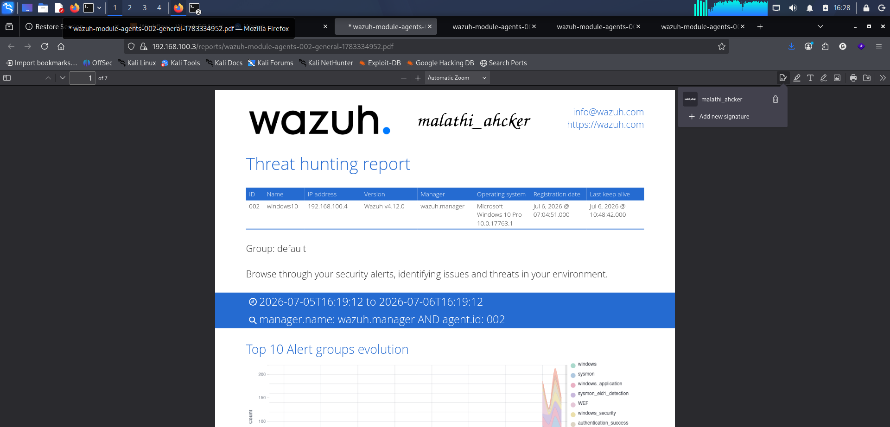
*Figure 9: The auto-generated PDF Threat Hunting report exported from the Wazuh Dashboard.*


*Figure 10: Automated email notification generated by the SOAR workflow, confirming successful alert processing.*


*Figure 11: A single alert email opened, showing the content pushed through from the workflow.*

---

## Closing Notes

Everything above reflects the order things actually happened, including the disk-corruption incident in Chapter 10 that forced a full rebuild of both stacks. If you're building something similar yourself, expect to hit some version of most of these nineteen issues - that's normal, and it's genuinely where most of the learning happens.
