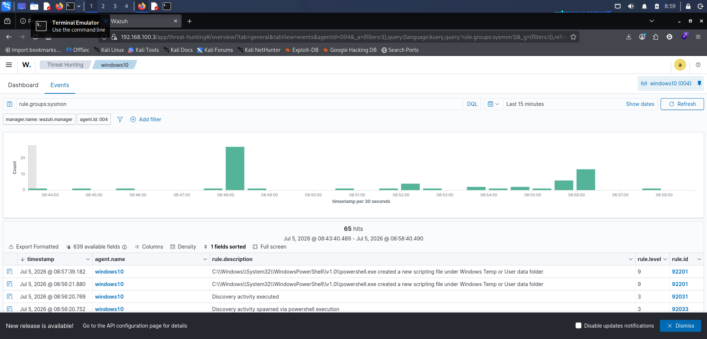
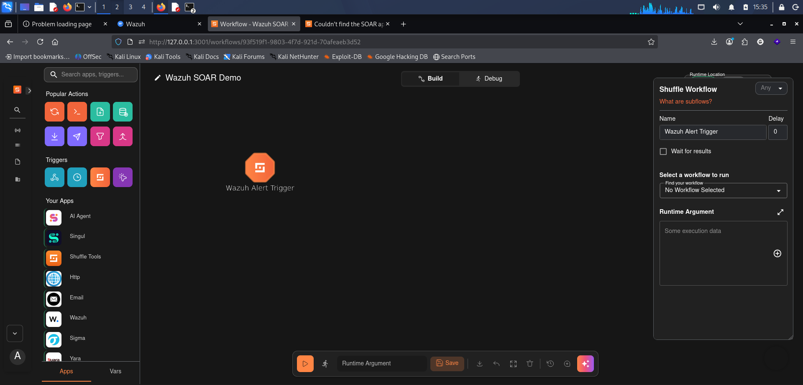
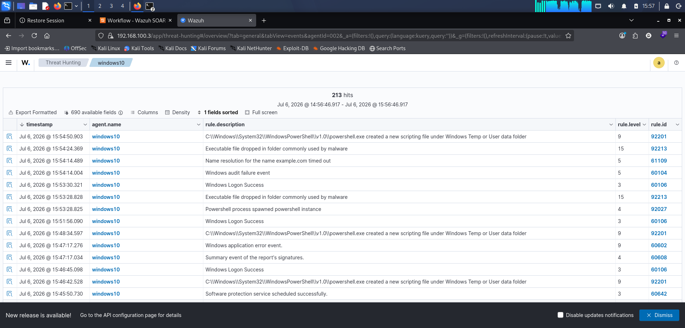
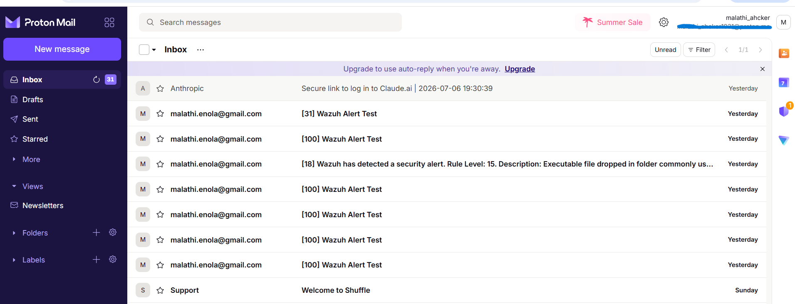

# Threat Detection and Automated Incident Response using Wazuh SIEM and Shuffle SOAR

[](https://wazuh.com)
[](https://shuffler.io)
[](https://docker.com)
[](https://learn.microsoft.com/sysinternals/downloads/sysmon)
[](https://kali.org)
[](https://microsoft.com)

📄 **Full build documentation, every command and every issue I hit → [CONFIGURATION_GUIDE.md](./CONFIGURATION_GUIDE.md)**

## Project Overview

This is a follow-up to my earlier [Wazuh + Sysmon SIEM lab](https://github.com/malathi-cyber-sketch/wazuh-sysmon-siem-home-lab). That project stopped at detection — Wazuh raises an alert, I go look at the dashboard. This one closes the loop: when Wazuh's Manager flags something suspicious on the monitored Windows endpoint, the alert is pushed automatically to Shuffle, an open-source SOAR platform, which authenticates against the Wazuh REST API and sends an email notification on its own. Nobody has to be watching the dashboard for the alert to reach someone.

The goal wasn't just to get a workflow diagram to look nice in Shuffle's UI. I wanted to actually build the authentication, the webhook, and the notification path myself, using the real Wazuh API, and be able to explain every part of it in an interview afterward.

## Architecture

```
[Windows 10 endpoint]
    Sysmon + Wazuh Agent
              |
              v
[Kali Linux - Docker project #1]
    Wazuh Manager / Indexer / Dashboard
              |
        webhook alert (HTTP)
              v
[Kali Linux - Docker project #2, separate compose]
    Shuffle Backend / Frontend / OpenSearch
              |
   Webhook --> HTTP node (JWT auth to Wazuh API) --> Email node (SMTP)
              |
              v
        analyst's inbox
```

Wazuh and Shuffle are kept as two completely separate Docker Compose projects, connected only by the webhook and not by a shared Docker network. That decision meant that when the Shuffle side of things broke midway through the build (see Chapter 10), the Wazuh stack never noticed and kept running.

## Technologies Used

| Category | Tool |
|---|---|
| SIEM | Wazuh 4.12.0 (Manager, Indexer, Dashboard) |
| SOAR | Shuffle (self-hosted) |
| Endpoint telemetry | Sysmon |
| Containerization | Docker / Docker Compose |
| Endpoint OS | Windows 10 |
| SIEM/SOAR host | Kali Linux |
| Notification | SMTP (Gmail relay) → Proton Mail |
| Attack simulation | PowerShell, Nmap |

## Features

- Wazuh SIEM stack deployed in Docker, monitoring a real Windows 10 endpoint
- Sysmon-based telemetry feeding real detections into Wazuh (process creation, file drops, PowerShell activity, discovery behavior)
- Wazuh alerts pushed to Shuffle over a webhook
- Manual JWT authentication against the live Wazuh REST API from inside a Shuffle workflow, built after the official vendor integration turned out to be broken
- Automated email notification triggered on every alert
- Pipeline load-tested with a scripted loop of ten alerts fired straight at the webhook
- Real endpoint attack simulation (PowerShell recon/privilege enumeration, Nmap scan) captured end-to-end in Wazuh's Threat Hunting view
- Generated alerts mapped back to MITRE ATT&CK techniques (T1087, T1016, T1027, T1059.001, T1204 — see [CONFIGURATION_GUIDE.md](./CONFIGURATION_GUIDE.md#mitre-attck-mapping))
- PDF Threat Hunting report generated directly from the Wazuh Dashboard

## Installation Guide (short version)

The complete step-by-step, with every command and the exact output I got back, is in [CONFIGURATION_GUIDE.md](./CONFIGURATION_GUIDE.md). Summary:

```bash
# Wazuh - pinned to a tagged release
git clone -b v4.12.0 https://github.com/wazuh/wazuh-docker.git
cd wazuh-docker/single-node
docker compose -f generate-indexer-certs.yml run --rm generator
docker compose up -d

# Shuffle - separate compose project, port remapped to avoid a conflict with Wazuh's Indexer
mkdir -p ~/Projects/wazuh-soar/docker && cd ~/Projects/wazuh-soar/docker
git clone https://github.com/Shuffle/Shuffle.git
cd Shuffle
docker compose up -d

# Windows endpoint
Invoke-WebRequest -Uri https://packages.wazuh.com/4.x/windows/wazuh-agent-4.12.0-1.msi -OutFile $env:TEMP\wazuh-agent.msi
msiexec.exe /i $env:TEMP\wazuh-agent.msi /q WAZUH_MANAGER="<kali-ip>" WAZUH_AGENT_NAME="windows10"
```

Then build a Shuffle workflow: Webhook trigger → HTTP node (Bearer JWT against the Wazuh API) → Email SMTP node.

## Proof of Execution

| | |
|---|---|
|  |  |
| Figure 1: Wazuh Threat Hunting view showing live Sysmon detections for the monitored endpoint. | Figure 2: Successful execution of the Shuffle workflow after receiving a Wazuh alert. |
|  |  |
| Figure 3: 213 hits recorded in Wazuh Threat Hunting across a single session. | Figure 4: Automated email notification generated by the SOAR workflow, confirming successful alert processing. |

Full captioned set of 33 screenshots is in [`/screenshots`](./screenshots) and referenced throughout [CONFIGURATION_GUIDE.md](./CONFIGURATION_GUIDE.md).

## Results

By the end of the session, Wazuh's Threat Hunting view had logged 213+ hits for the monitored endpoint, correctly attributed and including a severity-15 detection (executable dropped in a folder commonly used by malware). The Shuffle workflow ran successfully on every single test, both against synthetic alerts fired through a scripted loop and against real attack activity generated on the endpoint. A PDF Threat Hunting report was generated directly from the Wazuh Dashboard as a concrete artifact beyond live screenshots.

## Lessons Learned

- Pinning the Wazuh version mattered more than I expected. My earlier lab pulled whatever the `main` branch had at the time, and this project locked to `v4.12.0` after remembering how much that branch's structure had already shifted once.
- A broken vendor integration isn't a dead end. When Shuffle's official Wazuh app turned out to reference a dead Docker image, building the same thing manually with an HTTP node and JWT auth taught me the actual Wazuh API instead of hiding it behind a connector.
- `localhost` inside a Docker container means the container itself, not the host machine. This one cost more debugging time across the project than anything else.
- Keeping unrelated stacks in separate Compose projects paid off directly — when Shuffle broke, Wazuh kept running without any changes on my end.
- `docker system prune` exists for a reason. Reaching for a manual `rm -rf` inside Docker's own storage instead cost an entire environment rebuild.

## Future Improvements

I've scoped these out in detail but haven't run them yet — full technical plan for each is in [CONFIGURATION_GUIDE.md, Chapter 11](./CONFIGURATION_GUIDE.md).

- A custom Wazuh detection rule (written, not just default rules firing) to flag encoded PowerShell commands with higher confidence than the generic rule currently does
- A VirusTotal lookup step added to the Shuffle workflow before the email fires, so notifications include a threat-intel verdict instead of just the raw alert
- A short screen recording of the full pipeline firing in one continuous take
- A Slack or Discord notification alongside email
- Wazuh Active Response to isolate the endpoint automatically on high-severity alerts
- A dedicated attacker VM, separate from the victim endpoint, for cleaner technique-by-technique testing

## Repository Structure

```
Threat-Hunting-with-Wazuh-and-Shuffle-SOAR/
├── README.md                 (you are here)
├── CONFIGURATION_GUIDE.md    (complete chapter-by-chapter build log)
├── LICENSE
└── screenshots/               (33 captioned screenshots)
```

## About Me

I'm Malathi (Enola) — working on getting into a SOC Analyst role, coming from a 6-month cybersecurity internship covering IDS/firewall operations, VAPT, and SOC work. My [first lab](https://github.com/malathi-cyber-sketch/wazuh-sysmon-siem-home-lab) proved I could run a SIEM and read my own alerts. This one is about closing the loop from detection to automated response, which is the part real SOC tooling is actually built around. Still learning, and open to feedback on anything I got wrong or could have done cleaner.

[LinkedIn](https://linkedin.com/in/malathi-mittapalli-enola-b73208413) · [GitHub](https://github.com/malathi-cyber-sketch)


